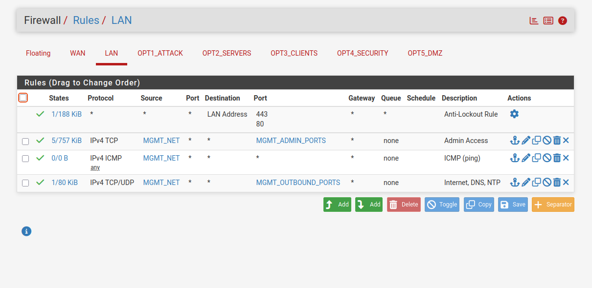

# 🔥 pfSense Configuration

## Overview

pfSense is the central firewall and router in this lab.

It handles:
- routing between networks
- firewall rules
- DHCP services
- DNS forwarding to Active Directory

All traffic between networks passes through pfSense, which allows controlled and secure communication between segments.

---

## 🧱 Initial Setup

### 1. Installation

- pfSense deployed as a virtual machine in VMware Workstation
- Multiple virtual NICs assigned:
  - WAN (external access)
  - LAN (management)
  - OPT1–OPT5 (segmented internal networks)

---

### 2. Interface Assignment

Each VMware virtual network is mapped to a dedicated pfSense interface.

| Interface | Role     | Subnet          |
|----------|----------|-----------------|
| WAN      | Internet | DHCP            |
| LAN      | MGMT     | 192.168.0.0/24  |
| OPT1     | ATTACK   | 192.168.10.0/24 |
| OPT2     | SERVERS  | 192.168.20.0/24 |
| OPT3     | CLIENTS  | 192.168.30.0/24 |
| OPT4     | SECURITY | 192.168.40.0/24 |
| OPT5     | DMZ      | 192.168.50.0/24 |

Segmentation is implemented using separate VMware networks (no VLANs).

---

## 🌐 Interface Configuration

Each interface uses a static gateway IP:

- LAN → 192.168.0.254  
- OPT1 → 192.168.10.254  
- OPT2 → 192.168.20.254  
- OPT3 → 192.168.30.254  
- OPT4 → 192.168.40.254  
- OPT5 → 192.168.50.254  

WAN uses DHCP.

---

## 🔐 Management Access

Access to the pfSense web interface is restricted to the MGMT network only.

- Allowed: 192.168.0.0/24  
- Denied: all other networks  

This keeps management access separate from the rest of the lab.

---

## 📡 DHCP Configuration

### Dynamic Ranges

**ATTACK (OPT1)**  
- Range: 192.168.10.100–200  
- Client: Kali Linux  

**CLIENTS (OPT3)**  
- Range: 192.168.30.100–200  
- Client: Windows 11  

---

### Static Addresses (Servers)

Key systems use static IPs:

- Domain Controller (AD/DNS) → 192.168.20.10  
- Kubernetes Master → 192.168.20.20  
- Kubernetes Workers → 192.168.20.21–22  

---

## 🌍 DNS Configuration

pfSense forwards DNS queries to Active Directory.

- Domain: corp.lab  
- DNS Server: 192.168.20.10  

Clients receive via DHCP:
- DNS server (AD)
- domain suffix (corp.lab)

All internal name resolution is handled by AD.

---

# 🔥 Firewall Policy

## Default Rule

**Deny all traffic by default**

All communication between networks must be explicitly allowed.

---

## 🔐 Network Rules

### 🟢 MGMT (LAN)

Management network used for administration.

Allowed:
- SSH (22)
- RDP (3389)
- HTTPS (443)
- WinRM (5985, 5986)
- ICMP

Notes:
- This is the only trusted admin network

---

### 🟡 SERVERS (OPT2)

Network for core services:
- Active Directory
- Kubernetes cluster
- internal applications

Rules:
- Allow management access from MGMT
- Allow required access from CLIENTS
- Allow communication between servers (e.g. Kubernetes)

Blocked:
- direct access from ATTACK (unless allowed for testing)
- unnecessary access from other networks

---

### 🔵 CLIENTS (OPT3)

User network with limited access.

Allowed:

**To Domain Controller (192.168.20.10):**
- DNS (53)
- Kerberos (88)
- LDAP (389)
- SMB (445)
- RPC (135)
- Kerberos password (464)
- Global Catalog (3268, 3269)
- WinRM (5985, 5986)

**To internal services:**
- HTTP/HTTPS (80/443) to selected applications (e.g. Kubernetes ingress)

Blocked:
- full access to server subnet
- access to MGMT network

---

### 🔴 ATTACK (OPT1)

Untrusted testing network.

Allowed:
- internet access (updates, tools)
- ICMP
- HTTP/HTTPS
- DNS (to approved server)

Restricted:
- no access to MGMT
- no direct access to CLIENTS

Controlled:
- limited access to SERVERS for testing (e.g. scans)

---

### 🟣 SECURITY (OPT4)

Reserved for future use:
- monitoring
- logging
- security tools

No rules configured yet.

---

### ⚫ DMZ (OPT5)

Reserved for future public services.

- isolated by default
- no active rules

---

## 🔄 Testing

### Connectivity

- MGMT → all networks ✔  
- CLIENTS → Domain Controller ✔  
- ATTACK → SERVERS (controlled) ✔  

---

### DNS

- corp.lab resolves correctly via AD ✔  

---

## 📸 Snapshots

Snapshots were taken after:
- installation
- interface setup
- DHCP setup
- firewall rules

This allows easy rollback during testing.

---

## 🧠 Key Design Choices

- separate networks instead of VLANs
- pfSense as central firewall
- default deny between networks
- dedicated management network
- AD used for DNS
- WinRM enabled for remote management

---

## ⚠️ Summary

pfSense controls all traffic between networks in this lab.

It enforces segmentation and ensures that communication between systems is limited to what is actually needed.
