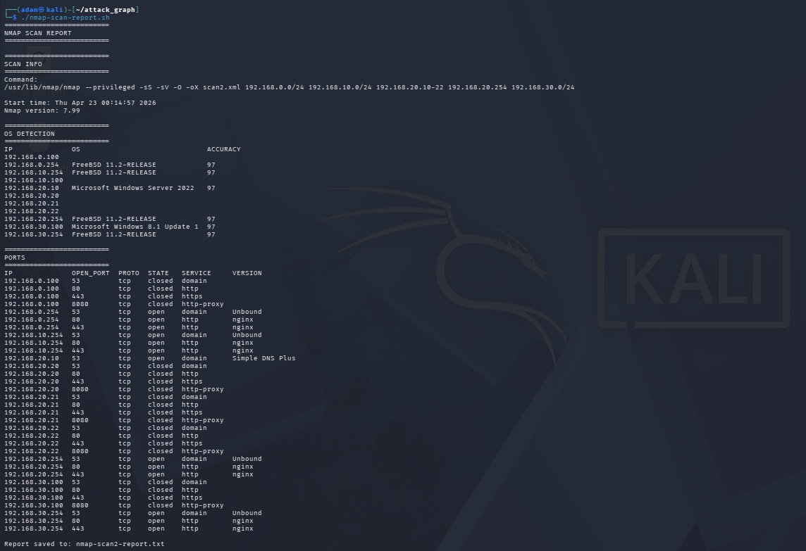
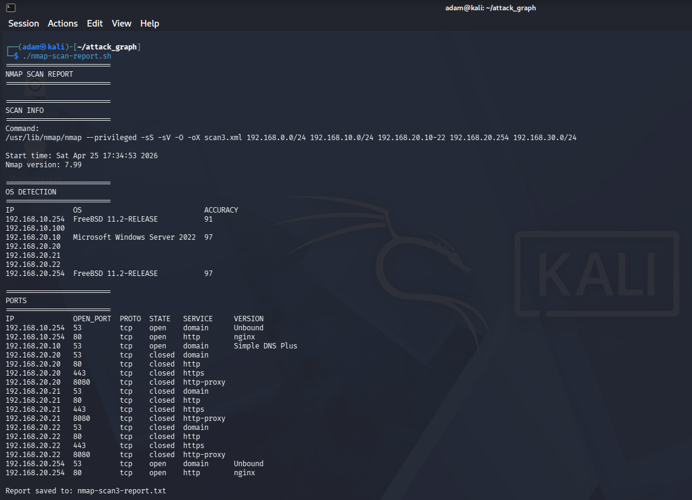

🛡️ Security & Network Testing
Overview

This lab includes a dedicated ATTACK network used to simulate basic offensive security scenarios and validate network segmentation.

The goal is not full penetration testing, but rather:

verifying firewall rules
testing network exposure
understanding how services are visible across segments

Kali Linux is used as the primary testing host.

🧱 Security Model

The environment follows a segmented architecture:

MGMT → trusted (administration)
SERVERS → critical infrastructure
CLIENTS → user layer
ATTACK → untrusted / hostile

All traffic between these networks is controlled by pfSense.

⚔️ Attack Simulation Environment
Kali Linux (ATTACK Network)
IP: 192.168.10.100
Role: simulated attacker

This host is treated as an untrusted system with limited permissions.

🔍 Scan Methodology

All tests were performed using Nmap.

Scan Command
nmap -sS -sV -O -oX scan.xml <targets>
Purpose
SYN scan (-sS) → stealth port scanning
service detection (-sV)
OS fingerprinting (-O)
XML output for structured analysis

📊 Baseline Scan (Before Firewall Hardening)

Key Findings

🌐 Host Visibility

Multiple subnets visible from ATTACK network
Hosts detected across MGMT, CLIENTS and SERVERS ranges

👉 Indicates broad network visibility

🖥️ OS Detection

IP	OS
192.168.x.254	FreeBSD (firewall)
192.168.20.10	Windows Server 2022
192.168.30.100	Windows 8.1

👉 Multiple systems fingerprintable → information leakage

🔌 Service Exposure

Firewall interfaces (multiple networks):

port 53 → DNS (Unbound)
port 80 → HTTP (nginx)
port 443 → HTTPS (nginx)

Domain Controller:

port 53 → DNS (Simple DNS Plus)

Other hosts:

ports mostly closed

⚠️ Interpretation

Firewall exposes web interface (80/443) across networks
Client network (Windows 8.1) is visible
Multiple subnets reachable from ATTACK

👉 This increases the attack surface and reconnaissance capability

🔥 Scan After Firewall Hardening

Key Findings

🌐 Host Visibility

Only selected hosts visible:
192.168.10.x
192.168.20.x

👉 Reduced network exposure

🔌 Service Exposure

Firewall:

port 53 → DNS
port 80 → HTTP
port 443 → no longer exposed

Domain Controller:

port 53 remains accessible

Other hosts:

all tested ports closed

🖥️ OS Detection

Fewer systems fingerprintable
Client systems no longer visible

👉 Reduced information disclosure

📉 Before vs After Comparison

Category	Before Hardening	After Hardening
Visible Networks	Multiple	Limited
Client Visibility	Yes	No
Firewall HTTPS (443)	Exposed	Removed
OS Fingerprinting	Multiple hosts	Limited
Attack Surface	Higher	Reduced

🌐 DNS Validation

DNS behaviour remained consistent across both scans.

Observations
Domain Controller (192.168.20.10) responds to DNS queries
No other hosts act as DNS servers
DNS is centrally managed

Required services remain accessible after hardening

Evidence-Based Conclusions

Based on scan results:

What Improved
Reduced number of visible networks
Removal of HTTPS exposure on firewall
Elimination of client network visibility
Lower OS fingerprinting success
What Remains Accessible (by design)
DNS service on Domain Controller
DNS resolver on firewall

⚠️ What This Means

From an attacker perspective:

Before:

can map multiple networks
sees firewall services (nginx)
identifies client OS
gains high-level infrastructure awareness

After:

limited to minimal infrastructure visibility
cannot identify client systems
reduced ability to fingerprint environment

🔐 Security Principles Observed

Network Segmentation

Visibility between networks is restricted after firewall changes.

Least Privilege

Only required services (DNS) remain accessible.

Reduced Attack Surface

Unnecessary services (e.g. HTTPS on firewall) were removed.

📌 Final Summary

This lab demonstrates how firewall configuration in pfSense directly impacts network visibility and attack surface.

Using Nmap as a validation tool:

baseline scans revealed excessive exposure
firewall hardening significantly reduced visibility
required services remained functional

The results confirm that segmentation and rule tuning effectively improve security posture in a controlled lab environment.

🚧 Future Improvements

SIEM integration (Wazuh)
monitoring (Zabbix)
centralised logging
alerting and detection