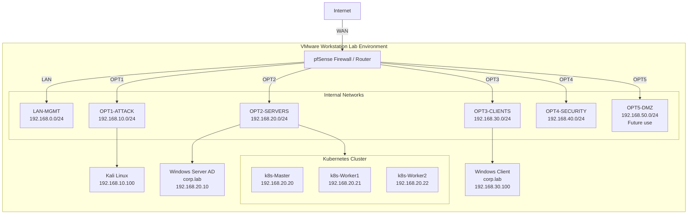

## Lab Topology

# 🌐 Network Topology

## Overview

This lab is designed as a segmented enterprise-style network, where each subnet represents a specific role within the infrastructure.

At the core of the topology is **pfSense**, acting as:

* router
* firewall
* DHCP server
* traffic control point between all networks

Due to limitations of VMware Workstation (no native support for VLAN tagging in this setup), network segmentation is implemented using **separate virtual networks (LAN, OPT1–OPT5)** instead of VLANs.

Each interface on pfSense is mapped to a dedicated virtual network, effectively simulating physical network segmentation.

The environment is intentionally divided into multiple zones to simulate real-world security boundaries and enforce controlled communication between systems.

---

## 🧩 Logical Segmentation

The network is split into the following segments:

| Network         | Role                                 |
| --------------- | ------------------------------------ |
| LAN (MGMT)      | Management and administration        |
| OPT1 (ATTACK)   | Offensive security / testing         |
| OPT2 (SERVERS)  | Core infrastructure (AD, Kubernetes) |
| OPT3 (CLIENTS)  | End-user devices                     |
| OPT4 (SECURITY) | Monitoring and logging (planned)     |
| OPT5 (DMZ)      | External-facing services (planned)   |

Instead of VLAN-based segmentation, each network is implemented as a **separate virtual switch/network in VMware Workstation**, connected to a dedicated pfSense interface.

This approach provides clear isolation while remaining compatible with the virtualization platform.

---

## 🔍 Network Zones Description

### 🟢 MGMT (LAN) — Trusted / Restricted

* Used for administrative access
* Contains Ubuntu Desktop (management host)
* Only network allowed to access pfSense GUI
* Has controlled access to all other segments

---

### 🔴 ATTACK (OPT1) — Untrusted

* Contains Kali Linux
* Used for:

  * network scanning
  * enumeration
  * security testing
* Treated as a hostile network by design

---

### 🟡 SERVERS (OPT2) — Critical Infrastructure

* Core services:

  * Active Directory (Domain Controller + DNS)
  * Kubernetes cluster (control-plane + workers)
* Uses static IP addressing
* Strictly controlled inbound access

---

### 🔵 CLIENTS (OPT3) — User Layer

* Windows 11 client (domain joined)
* Uses DHCP
* Communicates with:

  * Active Directory (authentication, DNS)
  * internal services

---

### 🟣 SECURITY (OPT4) — Monitoring Zone (Planned)

* Reserved for:

  * Wazuh (SIEM)
  * Zabbix (monitoring)
* Intended to aggregate logs and metrics from all networks

---

### ⚫ DMZ (OPT5) — External Services (Planned)

* Designed for public-facing services
* Intended use:

  * reverse proxy
  * load balancer
* Isolated from internal networks

---

## 📡 IP Addressing Strategy

Each subnet follows a consistent addressing scheme:

* `.1–.9` → infrastructure (reserved)
* `.10–.50` → servers (static IP)
* `.100–200` → DHCP clients
* `.254` → default gateway (pfSense)

### Subnets

| Network  | Subnet          | Gateway        |
| -------- | --------------- | -------------- |
| MGMT     | 192.168.0.0/24  | 192.168.0.254  |
| ATTACK   | 192.168.10.0/24 | 192.168.10.254 |
| SERVERS  | 192.168.20.0/24 | 192.168.20.254 |
| CLIENTS  | 192.168.30.0/24 | 192.168.30.254 |
| SECURITY | 192.168.40.0/24 | 192.168.40.254 |
| DMZ      | 192.168.50.0/24 | 192.168.50.254 |

### Design Decisions

* **Static IPs for servers** ensure predictable service addressing
* **DHCP for clients** simplifies management and scaling
* **Consistent subnet structure** improves readability and troubleshooting

---

## 🔄 Traffic Flow

Traffic between networks is strictly controlled by pfSense firewall rules.

### Allowed Flows (examples)

* **CLIENTS → SERVERS**

  * DNS (53)
  * Kerberos / LDAP (Active Directory)
  * application access

* **MGMT → ALL NETWORKS**

  * SSH / RDP / administration access
  * full control for management purposes

* **ATTACK → SERVERS**

  * allowed for controlled testing (e.g. Nmap scans)

---

### Restricted Flows

* No direct communication between:

  * ATTACK ↔ CLIENTS
  * ATTACK ↔ MGMT
* No direct WAN exposure for internal networks
* Access is granted only when explicitly required

---

## 🔐 Security Design Principles

This lab follows basic enterprise security practices:

### 1. Network Segmentation

Each functional group is isolated in its own subnet.

---

### 2. Least Privilege

Traffic is denied by default and only explicitly allowed where necessary.

---

### 3. Controlled Management Access

Administrative interfaces (e.g. pfSense GUI) are accessible only from the MGMT network.

---

### 4. Isolation of Untrusted Systems

The ATTACK network is treated as hostile and separated from sensitive systems.

---

### 5. Separation of Roles

Infrastructure, users, monitoring, and external services are separated into dedicated zones.

---

## 🧠 Summary

This topology reflects a simplified but realistic enterprise network design:

* centralized control via firewall
* segmented architecture (implemented via virtual networks instead of VLANs)
* clearly defined trust boundaries
* controlled communication paths

It provides a strong foundation for:

* security testing
* infrastructure deployment
* monitoring and observability
* troubleshooting complex systems
